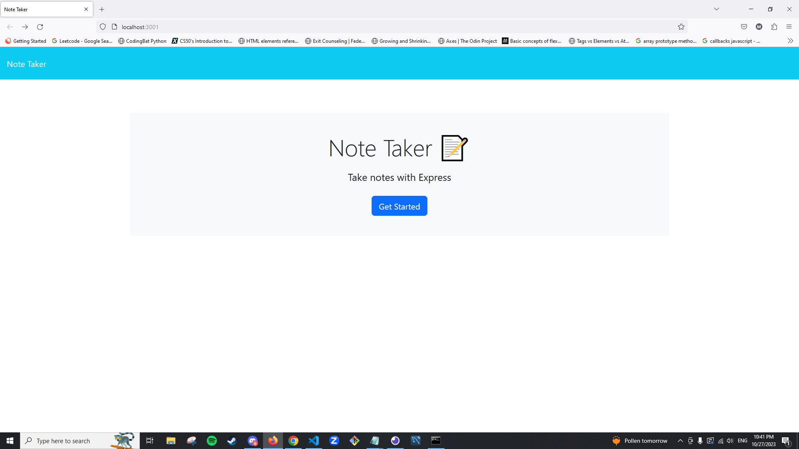

# Description

This is an assignment to create a web application that has a user to save and delete notes that they have wrote in the note taker.

Deployed Application: https://mat-2.github.io/note-taker/

## Summary

The assignment itself was fascinating, being able to experiment and trying to attempt and figure out how to do routing between APIs and html routes. It me a better understanding how websites can communicate between the front-end and back-end. However, the assignment was tough figuring out type Errors that was impacting the website's functionality, as well as needing to understand more using Express.JS.

## References

- https://www.geeksforgeeks.org/node-js-fs-readfile-method/
- https://www.geeksforgeeks.org/node-js-fs-readfilesync-method/

## License

Refer to LICENSE

## Installation

- Node.JS: https://nodejs.org/en npm init -y
- Inquirer v.8.2.4: https://www.npmjs.com/package/inquirer/v/8.2.4#installation
- Express v.4.16.4: https://expressjs.com/

## Screenshots

